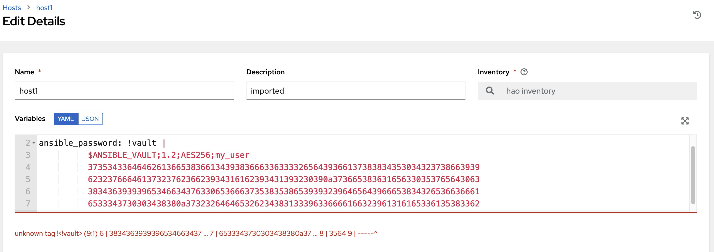

# ansible-vaulted-vars-in-awx

How to use vaulted vars in AWX - a not very good guide

## How it started

There's a long standing complaint in the AWX project around the fact that we can not use multiple Machine credential in a job.

For example I have 2 hosts in a inventory:

- host1
- host2

We can only use a single Machine credential for all of the hosts

This prompted some people in the community to use unsafe workaround like "lets just use the same username and password for all the hosts"

The safer workaround would be to put vaulted credential in invetory source as host/group vars.

But what if I don't want my inventory source to contain these vaulted string and I want these vars to live in AWX instead (seems simple enough...)

## Generate vaulted string (pretty easy)

For example the password for my `host1` is `host1_password`

```bash
ansible-vault encrypt_string --vault-id my_user@my-ansible-vault-pw-file 'host1_password' --name 'ansible_password' 2> /dev/null
```
`ansible-vault encrypt_string`: This is the main command that invokes the ansible-vault tool and instructs it to encrypt a string.

`--vault-id my_user@my-ansible-vault-pw-file`: This option specifies the vault ID and the path to the password file. In this case, the vault ID is `my_user` and the password file is [my-ansible-vault-pw-file](my-ansible-vault-pw-file). The vault ID and password file are used to access the vault and encrypt/decrypt the data.

`'host1_password'`: This is the string that you want to encrypt. In this example, the string `host2_password` is being encrypted.

`--name 'ansible_password'`: This option specifies the name of the encrypted string. In this case, the encrypted string will be named `ansible_password`.

`2> /dev/null`: Just to remove the `Encryption successful` that got printed out.

output of the command is something like (result is different every time)

```yaml
ansible_password: !vault |
          $ANSIBLE_VAULT;1.2;AES256;my_user
          64623364323032383430363033643131363761383930306464333566616230393239653962363535
          6332363734316135393035623061643038326136643530650a383562373733633735616235626236
          66653261643836623931336438626532353131303937366436626435343837623133626466393032
          3837623963646261630a653361383562626535643939313337626134333462373066373537366665
          3330
```

## Trying to put vaulted credential in AWX

This should be easy...

### Using the UI

When I first started I figure I can just go to the host UI and paste in the output of `ansible-vault encrypt_string` and be done with it...

and I get this...



Alright this seems like UI validation prevent us to even POST this...

### Using the API

PATCH with

```json
{
    "name": "host1",
    "variables": "ansible_user: host1_user\nansible_password: !vault |\n    $ANSIBLE_VAULT;1.2;AES256;my_user\n    32363032646232646635643331656531646166633061626465353366336437393062656130333062\n    6266316237643532373864336665333162666265396238660a626662326435396463633933666362\n    32636361623136636335363064646135633430636565646365383037343733346466353831313639\n    3732613238656331630a373031623335333134326436393861303634376435613065363531643432\n    3336"
}
```

and got

```json
{
    "variables": [
        "Cannot parse as JSON (error: Expecting value: line 1 column 1 (char 0)) or YAML (error: could not determine a constructor for the tag '!vault'\n  in \"<unicode string>\", line 2, column 19:\n    ansible_password: !vault |\n                      ^)."
    ]
}
```

### Maybe I can stringify it?

```yaml
ansible_password:|
          !vault |
          $ANSIBLE_VAULT;1.2;AES256;my_user
          37353433646462613665383661343938366633633332656439366137383834353034323738663939
          6232376664613732376236623934316162393431393230390a373665383631656330353765643063
          38343639393965346634376330653666373538353865393932396465643966653834326536636661
          6533343730303438380a373232646465326234383133396336666166323961316165336135383362
          3564
```

Nah, this doesn't work, ansible just going to end up treating it like a normal string instead of a vaulted string...

## Trying to understand how ansible-inventory see vaulted host vars

So I put together a [inventory file](inventory-w-vaulted-string.yml) with vaulted string and run

```bash
ansible-inventory -i inventory-w-vaulted-string.yml --list
```

and I got

```json
{
    "_meta": {
        "hostvars": {
            "host1": {
                "ansible_connection": "local",
                "ansible_password": {
                    "__ansible_vault": "$ANSIBLE_VAULT;1.2;AES256;my_user\n31383833383033633962356539306461383366646165393136393432356162343439316139653235\n6334356533633731366431376136343235393131633862360a356238613635363339633662633539\n61333561653465393430316262643936363631323238323735333436396462313433313338316463\n3764633337323735390a666334323032633331616136373934653139333439393764656162653461\n6337\n"
                },
                "ansible_user": "host1_user"
            },
            "host2": {
                "ansible_connection": "local",
                "ansible_password": {
                    "__ansible_vault": "$ANSIBLE_VAULT;1.2;AES256;my_user\n32633935363065316164386535326631643939623035353863303139613665386432326562383062\n6238356634353966666430643331623134366164313032660a643033356639646665323935626139\n62303563393336643865633939333431656365363265633835396462363361363131366538336161\n3662666264333338630a646433376631393666353534373865396531336265653135656266643064\n3836\n"
                },
                "ansible_user": "host2_user"
            }
        }
    },
    "all": {
        "children": [
            "ungrouped"
        ]
    },
    "ungrouped": {
        "hosts": [
            "host1",
            "host2"
        ]
    }
}
```

I see... `!vault` got expanded out to `__ansible_vault`

So if I turn

```yaml
ansible_password: !vault |
          $ANSIBLE_VAULT;1.2;AES256;my_user
          <numbers>
          <more numbers>
          ...
```

into

```yaml
"ansible_password":
  "__ansible_vault": |
          $ANSIBLE_VAULT;1.2;AES256;my_user
          <numbers>
          <more numbers>
          ...
```

this should work (and it does both in inventory file and in AWX)

## Scripting time

We wrote a pretty [simple script](vaulted_awxify.py) that convert the output of `ansible-vault encrypt_string` into something AWX can use.

Just pipe the output of `ansible-vault encrypt_string` into the script and you get a output that you can paste into AWX (or use in a playbook with awx collection)

example:

for yaml output

```bash
ansible-vault encrypt_string --vault-id my_user@my-ansible-vault-pw-file 'host1_password' --name 'ansible_password' 2> /dev/null | python vaulted_awxify.py
```

or if you want json output

```bash
ansible-vault encrypt_string --vault-id my_user@my-ansible-vault-pw-file 'host1_password' --name 'ansible_password' 2> /dev/null | python vaulted_awxify.py --json
```

## Special thanks

To https://github.com/jbradberry for going on this journey with me and preventing my ADHD from distracting myself and go do something like multi-arch build for AWX...

Also for his Ansible and AWX and Python expertiese.
